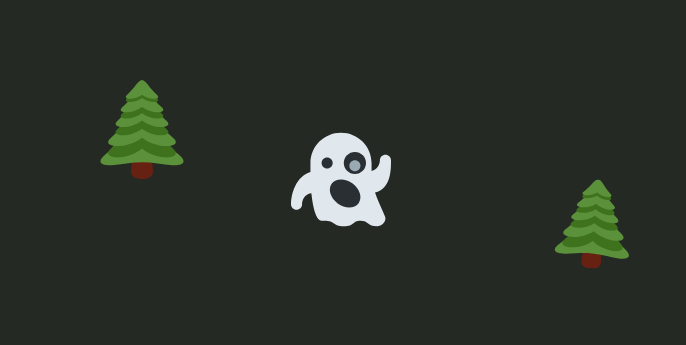

# CSS Gameview

A simple CSS system for creating 2D game or scene layouts.

`css-gameview` uses CSS custom properties to position, scale, and style elements (entities) within a container (view).

Defaults to positioning sprites in the center of the screen.

Can be used with any frontend library or Vanilla JS.

## How it works

- A main container element with the class `cgv` defines the "view".
- Use `--size` on the screen to define the number of sprites that should fit (e.g. 10 for 10x10 sprites view).
- Child elements with the class `cgv-entity` represent game entities.
- CSS custom properties (e.g., `--x`, `--y`, `--w`, `--h`, `--r`, `--s`) are set via inline styles on these entities to control their appearance and position.
- `cgv.css` contains the styles that interpret these custom properties.

See `index.html` for an example.
